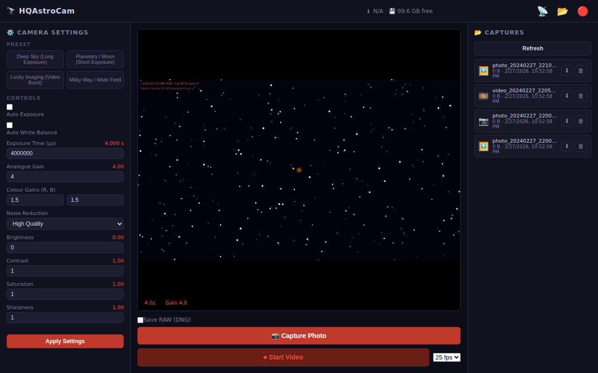
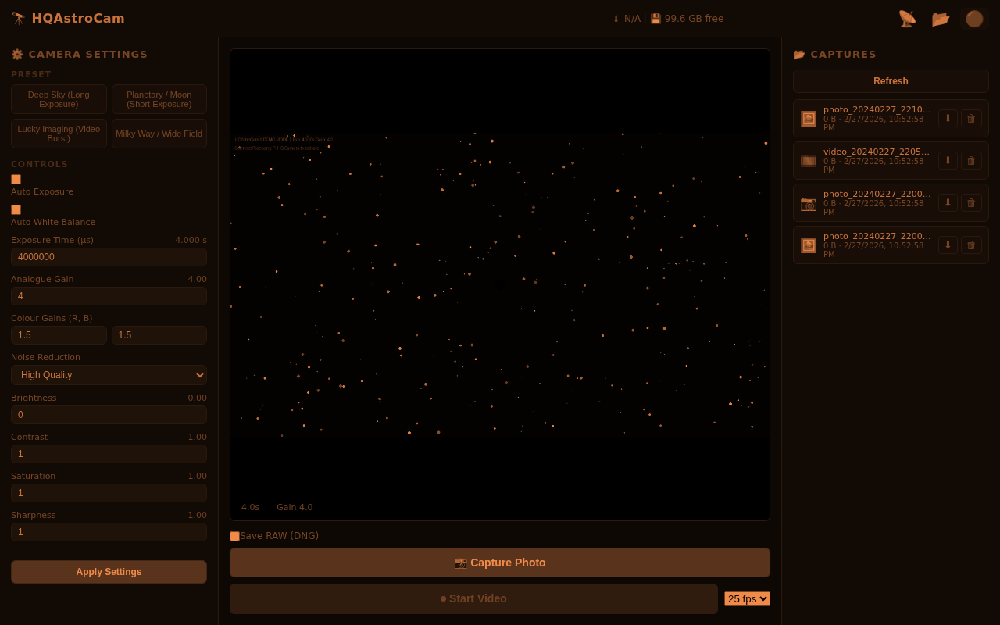
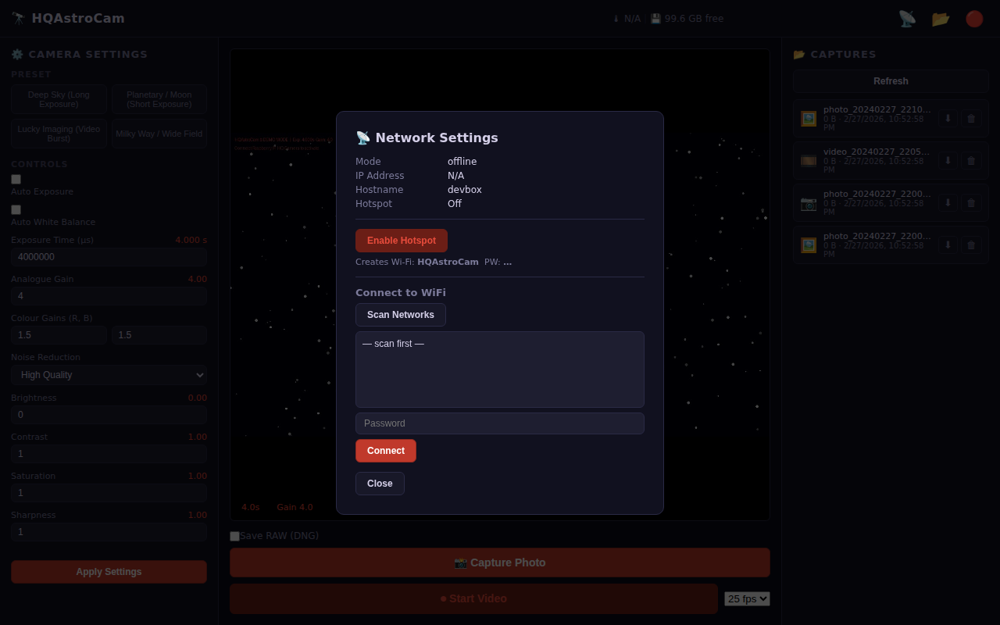

# 🔭 HQAstroCam

[](https://www.gnu.org/licenses/gpl-3.0)
[](https://www.python.org/)
[](https://www.raspberrypi.org/)
[](https://www.debian.org/)

**Turn your Raspberry Pi into a high-performance, standalone astrophotography rig.**

HQAstroCam is a purpose-built web application designed for the **Raspberry Pi HQ Camera (IMX477)**. It leverages the modern `libcamera` and `picamera2` stack to give you full manual control over your sensor from any device. Whether you're in your backyard or at a remote dark-sky site, HQAstroCam is your gateway to the stars.

---

## 🚀 The Story
> *"I spent WEEKS searching for usable software for the Raspberry Pi HQ Camera to use it as an Astrocam. I wanted something powerful like AstroDMx Capture but with a sleek, modern WebUI that works with the new camera stack. Since I couldn't find it, I built it."* — **The Creator**

---

## ✨ Why HQAstroCam?

- **🌙 Night-Vision Preserving**: A deep-navy and red UI designed to keep your eyes dark-adapted. Toggle "Red Mode" with one click for maximum protection.
- **🛰️ Zero-Config Field Work**: No router? No problem. HQAstroCam automatically spawns a Wi-Fi hotspot if no known networks are found—perfect for remote locations.
- **📸 Full Sensor Power**: Capture uncompressed **RAW (DNG)** and high-quality JPEG photos at full 12.3MP resolution.
- **🪐 Lucky Imaging Mode**: Record high-framerate H.264 MP4 videos (up to 60 fps) to "beat the seeing" for planetary and lunar stacking.
- **⏱️ Long Exposures**: Native support for exposures from **100 µs up to 200 seconds**.
- **🎯 Pro Controls**: Fine-tune Gain, White Balance, Focus (Lens Position), Noise Reduction, and more in real-time.
- **📂 Built-in File Browser**: View, download, and manage your cosmic masterpieces directly from your browser.
- **🌡️ System Health**: Monitor your Pi's CPU temperature and disk space in real-time.

---

## 📱 User Interface

### Main Dashboard
The sleek dashboard provides all controls at your fingertips, with a live low-latency MJPEG preview.


### Night Vision (Dim) Mode
Protect your eyes during late-night sessions with a single click.


### Easy Networking
Connect to local Wi-Fi or manage your field hotspot with ease.


---

## 🛠️ Recommended Hardware

| Component | Recommendation |
| :--- | :--- |
| **Compute** | Raspberry Pi 4 or 5 (4GB+ recommended) |
| **Camera** | [Raspberry Pi High Quality Camera](https://www.raspberrypi.com/products/raspberry-pi-high-quality-camera/) (IMX477) |
| **Lens** | C/CS-mount lens (e.g., 6mm wide-field or 16mm telephoto) |
| **Filter** | **[IR-Cut Filter](https://www.raspberrypi.com/products/high-quality-camera-integrated-ir-cut-filter/)** (Highly recommended for natural colors) |
| **OS** | Raspberry Pi OS (Bookworm) or Debian 13 (Trixie) |

---

## 🚀 Quick Install

SSH into your Raspberry Pi and run the following command to install HQAstroCam:

```bash
git clone https://github.com/ProfessorQuantumUniverse/HQAstroCam.git
cd HQAstroCam
sudo bash install.sh
```

**⚠️ Note:** The installer might appear to pause at the last step (7/7). If it takes longer than 15 seconds, press `Ctrl + C`; the installation is already complete.

### Post-Install
After installation, reboot your Pi:
```bash
sudo reboot
```
The Web UI will be available at `http://<your-pi-ip>:8080`.

### Customizing Hotspot Credentials
Want to set your own network name and password *before* installing? Just export these variables:
```bash
export ASTROCAM_SSID="MySkyPi"
export ASTROCAM_HOTSPOT_PW="my_secure_password"
sudo bash install.sh
```

---

## 📷 Camera Verification

To ensure your Pi recognizes the HQ Camera properly:
1. Ensure the CSI ribbon cable is firmly connected to the **camera port**.
2. Check your `/boot/firmware/config.txt`. The installer ensures these lines are present:
   ```ini
   camera_auto_detect=1
   dtoverlay=imx477
   ```
3. Verify detection: `libcamera-hello --list-cameras`

---

## 🌌 Astrophotography Presets

Forget about messing with tricky settings in the dark. Use our built-in starting points:

*   **Deep Sky**: Optimized for nebulae and galaxies (30s exposure, high gain).
*   **Planetary / Moon**: Fast shutter speeds to freeze atmospheric turbulence.
*   **Lucky Imaging**: High-speed video burst for post-processing stacking.
*   **Milky Way**: Wide-field nightscape optimization.

---

## 📡 Connection Modes

1.  **Hotspot Mode (Field Work)**: If HQAstroCam can't find your home Wi-Fi, it creates its own network.
    *   **SSID:** `HQAstroCam`
    *   **Password:** Randomly generated (found in `/etc/astrocam.conf`).
    *   **URL:** `http://10.42.0.1:8080`
2.  **Wi-Fi Client**: Connect to your home or mobile hotspot via the Network Settings in the UI.
3.  **Ethernet**: Simply plug in a cable; it will be detected automatically.

---

## 🛠️ Service Management

The app runs in the background as a systemd service. Manage it via CLI:

```bash
# View live logs
journalctl -u astrocam -f

# Restart/Stop/Status
sudo systemctl restart astrocam
sudo systemctl stop astrocam
sudo systemctl status astrocam
```

---

## 💻 Development & Demo Mode

No Raspberry Pi? No problem! HQAstroCam features a **Demo Mode** with a synthetic star-field for UI development.

```bash
pip install -r requirements.txt
uvicorn app.main:app --host 0.0.0.0 --port 8080 --reload
```

---

## 🤝 Contributing

Contributions are what make the open-source community such an amazing place!
1. Fork the Project
2. Create your Feature Branch (`git checkout -b feature/AmazingFeature`)
3. Commit your Changes (`git commit -m 'Add some AmazingFeature'`)
4. Push to the Branch (`git push origin feature/AmazingFeature`)
5. Open a Pull Request

## 📜 License

Distributed under the **GPL-3.0 License**. See `LICENSE` for more information.

---

<p align="center">Made with ✨ for the Astrophotography Community</p>
